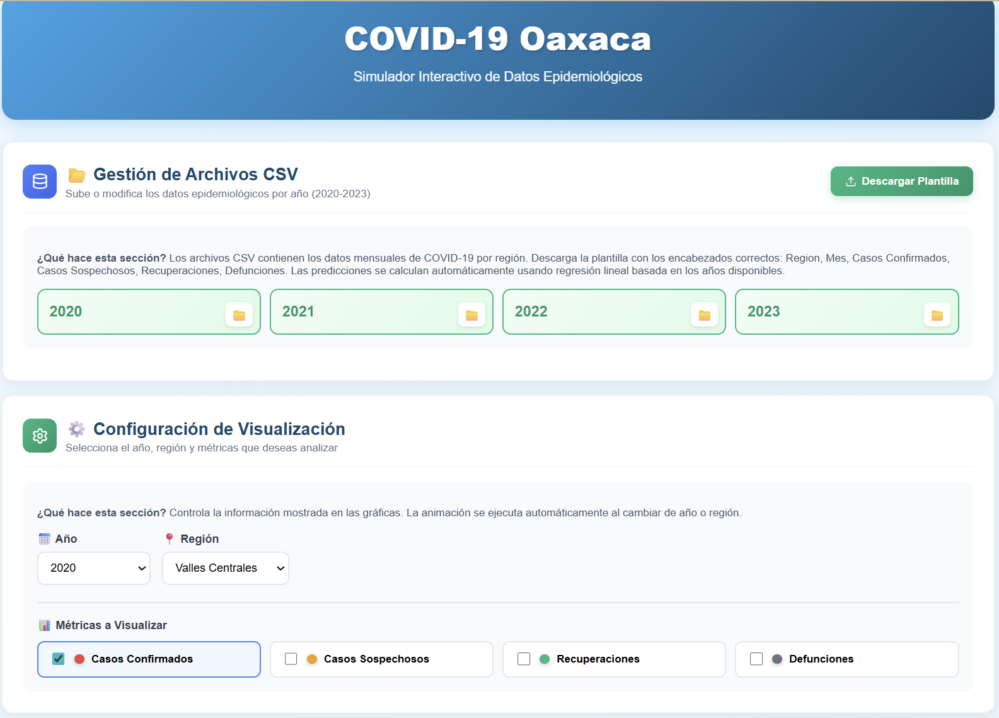
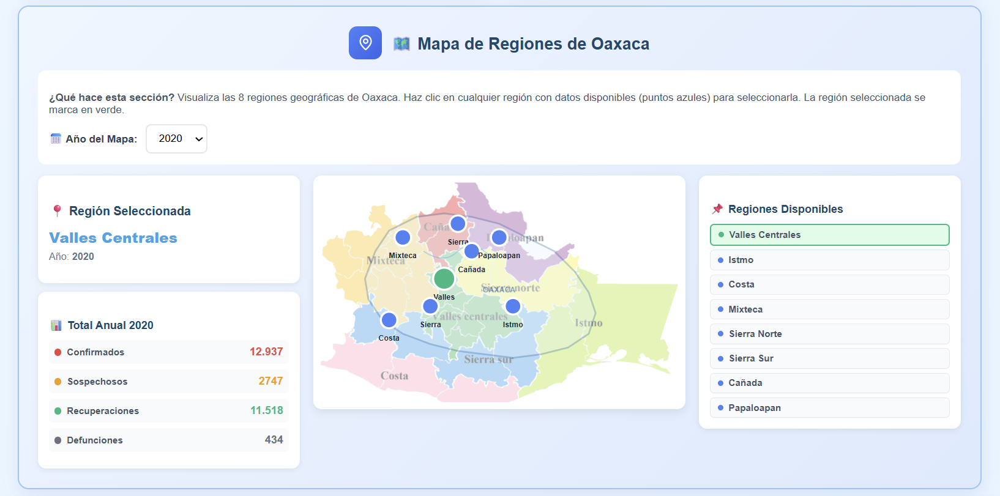
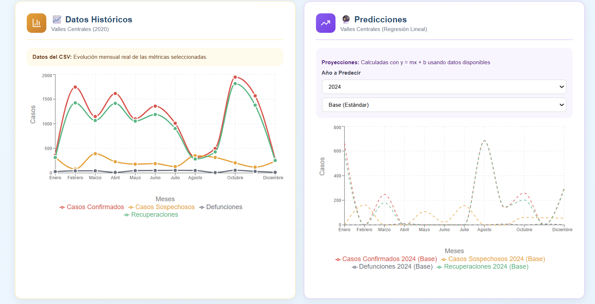
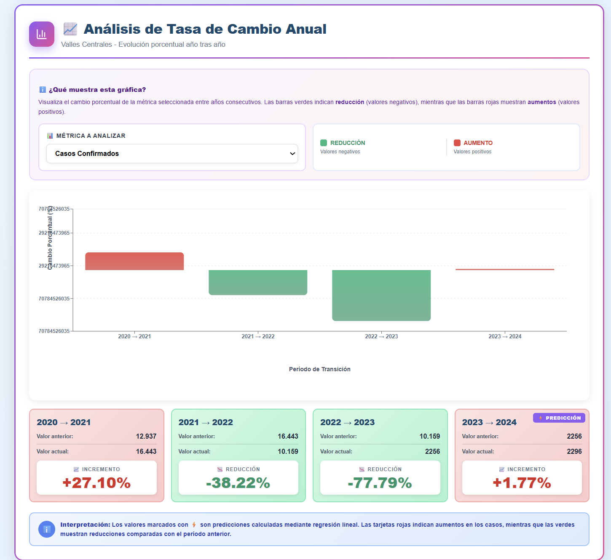

# Simulador Epidemiológico COVID-19 – Oaxaca (2020–2023)


Este proyecto implementa un simulador epidemiológico interactivo para analizar la evolución del **COVID-19** en el estado de **Oaxaca**. Utiliza **React**, procesamiento de archivos CSV, gráficas dinámicas y un **modelo SIRD discretizado** para estimar contagios, recuperaciones y defunciones.

El sistema permite visualizar datos reales, generar predicciones mediante regresión lineal y comparar escenarios epidemiológicos a nivel regional, sirviendo como una herramienta de apoyo en la toma de decisiones y el análisis exploratorio en salud pública.

---

## 1. Descripción General del Proyecto y Objetivos

El simulador fue desarrollado como una herramienta computacional para el análisis de sistemas dinámicos de salud pública. Los objetivos principales incluyen:

1.  **Análisis Temporal y Regional:** Estudiar la **evolución mensual** del COVID-19 en Oaxaca, contrastando las tendencias entre las ocho regiones del estado.
2.  **Modelado Híbrido:** Aplicar un **modelo SIRD discreto** para la simulación de las transiciones epidemiológicas, complementado con el uso de **regresión lineal** para la proyección de tendencias a corto y mediano plazo.
3.  **Generación de Escenarios:** Cuantificar el impacto de diferentes condiciones (optimista, base, pesimista) mediante la predicción estadística.
4.  **Visualización Interactiva:** Ofrecer una interfaz que facilite la interpretación de datos mediante **mapas de calor** (colorimetría) y **gráficas comparativas** en tiempo real.

Se integran datos históricos de las **ocho regiones** del estado, que son cruciales para el análisis segmentado: Valles Centrales, Istmo, Costa, Mixteca, Sierra Norte, Sierra Sur, Cañada y Papaloapan.

## 2. Modelo Epidemiológico: SIRD Discreto

El núcleo del proyecto reside en la implementación del **Modelo SIRD** (Susceptible-Infectado-Recuperado-Defunción), adaptado para simulación a tiempo discreto y enriquecido con componentes probabilísticos para aumentar el realismo.

### 2.1 Ecuaciones de Transición

El comportamiento general del sistema se basa en las siguientes ecuaciones diferenciales que describen el cambio en las poblaciones entre estados:

$$
\frac{dS}{dt} = −\beta \cdot \frac{S \cdot I}{N} \\
\frac{dI}{dt} = \beta \cdot \frac{S \cdot I}{N} − \gamma I − \mu I \\
\frac{dR}{dt} = \gamma I \\
\frac{dD}{dt} = \mu I
$$

Donde:
* $\beta$: Tasa de transmisión (Contagio).
* $\gamma$: Tasa de recuperación.
* $\mu$: Tasa de mortalidad.
* $N$: Población total de la región.

## 3. Arquitectura del Sistema y Flujo de Datos

El sistema está construido como una **SPA (Single Page Application)** utilizando React, lo que garantiza una interfaz de usuario reactiva y rápida. La arquitectura se centra en la modularidad para facilitar el mantenimiento y la extensión.

### 3.1 Módulos Clave

1.  **Lector de Datos (`DataLoader`):**
    * Utiliza **PapaParse** para leer y procesar archivos CSV.
    * Realiza validación de la estructura del archivo y normalización de los campos (`Región`, `Mes`, `Casos Confirmados`, etc.).
    * Almacena los datos históricos en el estado de la aplicación.
2.  **Motor de Simulación y Predicción:**
    * Contiene la lógica del modelo **SIRD discreto**.
    * Implementa la función `calculateLinearRegression` para la proyección de tendencias.
3.  **Visualización:**
    * **`MapView`:** Renderiza la geografía regional.
    * **`Charts`:** Renderiza los gráficos dinámicos con **Recharts**.
4.  **Comparador Epidemiológico (`CovidComparison`):**
    * Presenta las métricas de precisión y el análisis comparativo entre datos reales y los tres escenarios predictivos.

## 4. Datos Utilizados y Métricas de Validación

La robustez del simulador se basa en la calidad de los datos históricos ingresados y en las métricas utilizadas para evaluar la precisión de las predicciones.

### 4.1 Campos de Datos
Se espera que los archivos CSV de entrada contengan los siguientes campos para cada registro:

* `Región`, `Mes`, `Casos Confirmados`, `Casos Sospechosos`, `Recuperaciones`, `Defunciones`.

> El volumen de datos integrado es de **96 registros por año** (12 meses × 8 regiones).

### 4.2 Métricas Clave de Salud Pública

| Métrica | Descripción |
| :--- | :--- |
| Tasa de Letalidad | $Defunciones / Casos Confirmados$ |
| Tasa de Recuperación | $Recuperados / Casos Confirmados$ |
| Pico Epidemiológico | Mes con mayor número de casos registrados |
| Concentración Regional | Distribución de casos absolutos por región |

### 4.3 Métricas de Precisión del Modelo Predictivo

El módulo de Regresión Lineal evalúa la fiabilidad de las proyecciones mediante:

* **Error Absoluto (AE) y Error Porcentual (PE):** Miden la magnitud del error entre el valor real y el valor proyectado.
* **Coeficiente de Determinación (R²):** Es la métrica principal de bondad de ajuste de la regresión lineal. Un valor cercano a 1 indica que el modelo explica una alta proporción de la variabilidad de los datos. Se calcula como:
    $$
    R^2 = 1 - \frac{SS_{Res}}{SS_{Total}}
    $$

## 5. 🖼️ Visualización del Simulador

A continuación, se muestran las vistas principales de la aplicación, destacando la interacción y la presentación de resultados.

### 5.1 Interfaz Principal y Carga de Datos
Muestra el dashboard inicial y la sección donde el usuario interactúa para cargar el conjunto de datos CSV.
<p align="center">
  
</p>
<p align="center">
  *Figura 1: Vista del dashboard inicial. Se utilizan iconos de Lucide React (Upload, Settings, Database) para la gestión del sistema.*
</p>

### 5.2 Mapa Interactivo y Gráfica de Tendencias
Esta sección visualiza los casos por región mediante colorimetría y ofrece un resumen de la evolución de las métricas clave.
<p align="center">
  
</p>
<p align="center">
   <p align="center">
  
</p>
<p align="center">
  *Figura 2: Mapa de Oaxaca mostrando la concentración regional de casos y la gráfica de línea que detalla la tendencia temporal.*
</p>

### 5.3 Comparación Real vs Predicción
Detalle de las proyecciones futuras (Base, Optimista, Pesimista) y su contraste con los datos reales, incluyendo el cálculo del coeficiente R².
<p align="center">
  
</p>
<p align="center">
  *Figura 3: Gráfica comparativa que utiliza Recharts (LineChart) para diferenciar las tendencias de casos reales (línea sólida) contra los escenarios predichos (líneas discontinuas).*
</p>

---

## 7. Tecnologías Utilizadas

* **React.js** (Framework principal)
* **JavaScript** (Lenguaje de programación)
* **Recharts** (Generación de gráficas dinámicas de alto rendimiento)
* **PapaParse** (Análisis robusto y lectura de CSV)
* **XLSX.js** (Librería para exportación de reportes tabulares a formato Excel)
* **Lucide React** (Iconografía modular)
* **HTML5 / CSS3**

## 8. Estructura del Código
src/ │── components/ │ ├── MapView/ # Componente de Mapa Interactivo │ ├── Charts/ # Componentes de Gráficas de Tendencia │ ├── CovidComparison/ # Componente de Comparación Real vs Predicción │ └── DataLoader/ # Lector y Procesador de Archivos CSV │ │── utils/ │ ├── regression.js # Lógica de Regresión Lineal y cálculo de R² │ └── csvProcessor.js # Utilidades para normalización de datos │ │── App.js # Núcleo del Sistema y gestión de estado global │── index.js

## 9. Resultados Principales

El simulador permitió obtener las siguientes conclusiones clave:

* **Identificación de Picos:** Se localizaron los picos epidemiológicos con precisión en las distintas regiones y años del período 2020–2023.
* **Incidencia Regional:** Se confirmó que **Valles Centrales** fue la región con mayor incidencia acumulada.
* **Validación de Modelo:** El modelo SIRD adaptado mostró tendencias de recuperación y mortalidad consistentes con los reportes oficiales.
* **Precisión Predictiva:** El modelo de regresión lineal demostró ser útil para la generación de proyecciones de corto plazo con niveles moderados de precisión.

## 10. ⚙️ Comandos Disponibles

En este proyecto puedes ejecutar:

### `npm start`

Ejecuta la aplicación en modo desarrollo.
Abre `http://localhost:3000` en tu navegador.
La página se recarga al hacer cambios y puedes ver errores en la consola.

### `npm run build`

Crea una versión optimizada para producción en la carpeta `build`.
Los archivos se minifican y están listos para desplegar en cualquier servidor web estático.
Más info en la sección de deployment. 

## 11. Cómo Ejecutar el Proyecto

1.  **Clonar el repositorio**
    ```bash
    git clone [https://github.com/usuario/repositorio.git](https://github.com/usuario/repositorio.git)
    ```
2.  **Instalar dependencias**
    ```bash
    npm install
    ```
3.  **Iniciar la aplicación**
    ```bash
    npm start
    ```
4.  **Cargar los archivos CSV** desde la interfaz. El sistema procesará automáticamente los registros para generar las visualizaciones.

## 12. Conclusiones

El proyecto concluye que la implementación de un modelo SIRD en tiempo discreto, complementado con análisis de regresión lineal y visualización interactiva, constituye una **herramienta funcional y educativa** para el análisis exploratorio de fenómenos epidemiológicos regionales. La simulación estocástica añade una capa de realismo vital para el estudio de sistemas dinámicos de salud.

## 13. Integrantes del Proyecto

* Angel de Jesús Méndez García
* Santiago Emmanuel Pérez Jiménez
* María Isabel Pérez Cruz
